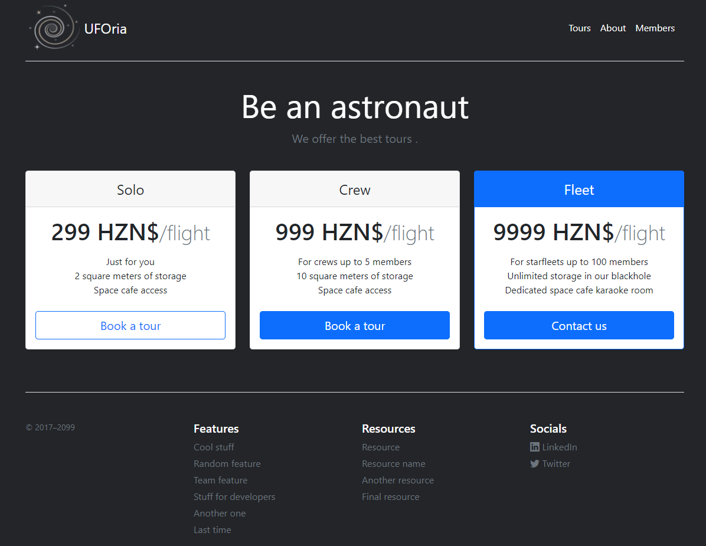
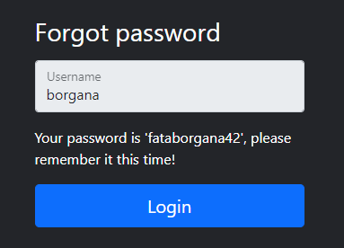

UFOria

Category: Web, OSINT  
Level: Beginner  

---


Image above explained the overview of the challenge. The challenge itself is divided into 2 sub-challenges and we are given a link to access the challenge for both the sub-challenges.  


## **_Challenge 1 - Invite Only_**:  

First challenge is to find the invite code from the given website link. The landing page can be seen like below:



It is a website for booking of flight to outer space. After some browsing through the page, we realized that the **'Contact us'** button under the 'Fleet' selection is where the invite code is required. Apart from that, found nothing that could lead to the invite code, thus let's move to the source code.   

Right click on the page and select 'Inspect' to view the source code. Not surprisingly, the lead to the retrieve the invite code can be found from a portion of the javascript code of the **'contactus'** function. You can view the snippet of the code as below:

```javascript
   function contactus() {
        var code = prompt("This option is invitation only. Enter your invite code:");

        var verify = (function(code) {
            if (code.length != 12) { return false; }

            var parts = [code.substr(0,3), code.substr(4,4), code.substr(9,3)];
            if (parts.join("-") != code) { return false; }

            if (parts[0] != "UFO") { return false; }
            if (parts[1] != btoa("UFO")) { return false; }
            if (parts[2] != ("UFO".charCodeAt(0) + "UFO".charCodeAt(1) + "UFO".charCodeAt(2))) { return false; }
   
            return true;
        })(code);

        if (verify) {
            alert("Great, please continue the booking process by sending us an email with your invitation code.")        
        } else {
            alert("Wrong invite code.")
        }
    }
```


Basically, what the code does is that it is validating the invite code entered by the user against a hardcoded strings inside the JavaScript code. The checking is divided into three parts and all the parts are actually joined by the character '-' when the user entered in the text box. Hence, we just need to decipher the three parts of the hardcoded strings to get the invite code.  


*First part:*

```javascript
if (parts[0] != "UFO") { return false; }
```
The first part is the easiest since it is straightforward without any encoding to the strings. The invite code is plain "UFO".  


*Second part & third part:*

```javascript
if (parts[1] != btoa("UFO")) { return false; }
if (parts[2] != ("UFO".charCodeAt(0) + "UFO".charCodeAt(1) + "UFO".charCodeAt(2))) { return false; }
```
Second and third part needed some work to be done to reveal the invite code.  

As seen from the snippets for the 2nd part, user's input is compared against a function `btoa()` which takes a string and converts it from binary to ASCII format.

For the 3rd part, it uses the method `charCodeAt()` to convert the string "UFO" and returns an integer representing the UTF-16 code unit at their given index, and then sums all the integer and there you will get your last part of invite code.

We can solved the above for part two and three using the **Console** under the **Developer tools** like below:


And there we have our second and third part of the invite code as "VUZP" and "234" respectively.  


Head on to the webpage and click on ''**Contact us**''  below:  


There will be a pop-up prompting for the invite code. Enter the invite code `UFO-VUZP-234`:    


<p align="center">
  
</p>


Another prompt with the following message will be displayed and we know that the invite code works:  

<p align="center">
  
</p>

Lastly, go ahead and submit that invite code as flag to get the points!


## **_Challenge 2 - Members Only_**:

Second challenge is to find a way to access the "**Members**" page which you can locate on the top right corner of the webpage:

<p align="center">
  
</p>


The members login page looks like below. And interestingly, it also provides a way to retrieve your forgotten or lost password. Thus, we only need to find out the username and the password we might be able to retrieve it from this function here. Next, find out the method to retrieve that password.

<p align="center">
  
</p>

Clicking the link to retrieve the password, it requires a username to be entered. And thus, I remembered earlier I did came across something that looks like a username under the "**About**" page when browsing the site:


From the "About" page, it gives us  "*borgana*" - a handle which belongs to the CEO of UFOria. Use that handle on the Username column:

<p align="center">
  
</p>

Now, we know that it uses security question to sort of like verify the identity of the user and in turn returns the password to the user when answer correctly. So, the question is asking about the birthplace of this user going by the handle of "borgana" which is the CEO, Ben Organa, of UFOria.

<p align="center">
  
</p>

Trying to do some OSINT search on "Ben Organa", "UFOria", and the handle "borgana" returns no valuable results that might help in finding the birthplace location. Until I noticed something when returning to the "About" page to look for clues. Below is quoted from the Word of the CEO:

> UFOria started as a small two-person company, but since the very beginning, we were dreaming big. I can never forget the day that we decided to establish the pillars of this company with Elliot Talton in our trip to our home town. That day will be with me until the end of my time. We have come a long way to make space tourism a new norm and we will continue to do so until we reach our objective.


This time round I noticed another person was mentioned in the above quote, Elliot Talton, who is a close friend of the CEO and also the co-founder of UFOria. A quick google search returns the list below where the third result seems like a huge lead.


Clicking into the Linkedin post and here we got ourselves another clue to the location where on the first post, Elliot mentioned about visiting a cafe, Lands Huys Cafe, which reminds him of his childhood memories:


Entering that cafe name to the Google search and here we might have found the place, "Bourtange, Netherlands" :


Using "Bourtange" as the birthplace location for the security question, we've gotten the password for the user!

<p align="center">
  
</p>


Now head back to the "**Members**" login page and use username 'borgana' and password 'fataborgana42' to login the members page, we have finally gotten the flag:

<p align="center">
  
</p>


### REFERENCES:

[1]  https://developer.mozilla.org/en-US/docs/Web/JavaScript/Reference/Global_Objects/String/charCodeAt

[2]  https://developer.mozilla.org/en-US/docs/Glossary/Base64

